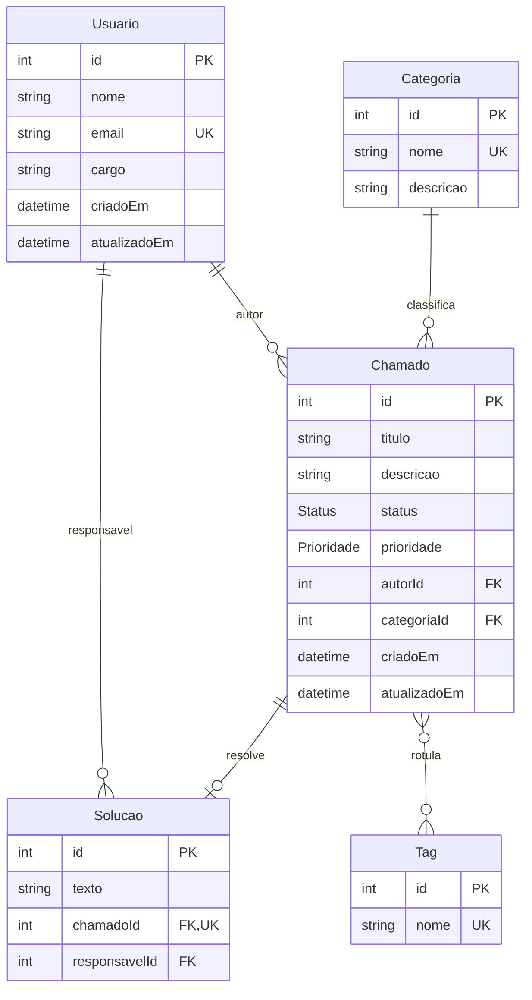

# DER — SmartHelp (Etapa 3)

Diagrama de Entidades e Relacionamentos do modelo Prisma (`prisma/schema.prisma`), sincronizado com os serviços em `src/services/`. Chaves primárias e estrangeiras são `Int` autoincrement (`@id @default(autoincrement())`). Não há `@@map`: as tabelas físicas mantêm os nomes default `"Usuario"`, `"Categoria"`, `"Chamado"`, `"Solucao"` e `"Tag"`, compatíveis com o SQL de `search.service.js`.

## Entidades

### Usuario
| Campo | Tipo | Restrições |
|---|---|---|
| id | Int | PK, autoincrement |
| nome | String | obrigatório |
| email | String | único (`@unique`), obrigatório |
| cargo | String? | opcional; usado na listagem pública de usuários, sem campos de autenticação |
| criadoEm | DateTime | default `now()` |
| atualizadoEm | DateTime | `@updatedAt` |

### Categoria
| Campo | Tipo | Restrições |
|---|---|---|
| id | Int | PK, autoincrement |
| nome | String | único, obrigatório |
| descricao | String? | opcional |
| criadoEm / atualizadoEm | DateTime | default `now()` / `@updatedAt` |

### Chamado
| Campo | Tipo | Restrições |
|---|---|---|
| id | Int | PK, autoincrement |
| titulo | String | obrigatório |
| descricao | String | obrigatório |
| status | Status | enum `ABERTO` (default), `EM_ATENDIMENTO`, `RESOLVIDO` |
| prioridade | Prioridade | enum `BAIXA`, `MEDIA` (default), `ALTA` |
| autorId | Int | FK → Usuario |
| categoriaId | Int | FK → Categoria |
| criadoEm / atualizadoEm | DateTime | default `now()` / `@updatedAt` |

Índices: `autorId`, `categoriaId`, `status`, `criadoEm` (filtros e ordenação usados em `chamadosService.listar`). Full-Text Search fica para a Etapa 8 (ainda não implementado no schema).

### Solucao
| Campo | Tipo | Restrições |
|---|---|---|
| id | Int | PK, autoincrement |
| texto | String | obrigatório |
| chamadoId | Int | FK → Chamado, **único** (`@unique`) — cardinalidade 1:1 com Chamado |
| responsavelId | Int | FK → Usuario |
| criadoEm / atualizadoEm | DateTime | default `now()` / `@updatedAt` |

### Tag
| Campo | Tipo | Restrições |
|---|---|---|
| id | Int | PK, autoincrement |
| nome | String | único, obrigatório |
| criadoEm / atualizadoEm | DateTime | default `now()` / `@updatedAt` |

## Relacionamentos e cardinalidades

| Relação | Cardinalidade | Chave | Deleção |
|---|---|---|---|
| Usuario —(autor de)— Chamado (`relation "ChamadoAutor"`) | 1 : N | `Chamado.autorId` → `Usuario.id` | `onDelete: Restrict` — não gera órfãos; autor não é removido com chamados abertos |
| Categoria — Chamado | 1 : N | `Chamado.categoriaId` → `Categoria.id` | `onDelete: Restrict` — categoria com chamados não pode ser excluída |
| Chamado — Solucao | 1 : 0..1 (cada Chamado tem no máximo uma solução, via `chamadoId @unique`) | `Solucao.chamadoId` → `Chamado.id` | `onDelete: Cascade` — excluir o chamado remove a solução (a solução não existe sem o chamado) |
| Usuario —(responsável por)— Solucao | 1 : N | `Solucao.responsavelId` → `Usuario.id` | `onDelete: Restrict` — mantém o histórico de quem resolveu |
| Chamado — Tag | M : N (tabela de junção implícita `_ChamadoToTag`) | relação implícita do Prisma | ações na tabela de junção geradas pelo Prisma e conferidas na migration; tags podem ser reutilizadas por `connectOrCreate` |

Todos os relacionamentos usam `onUpdate: Cascade`; nenhuma FK é anulável, portanto o banco nunca persiste registros órfãos.

## Diagrama (Mermaid)

## Notas de integração com o código

- `chamadosService` usa as relations `autor`, `categoria`, `tags`, `solucao` e os campos `autorId`, `categoriaId`, `responsavelId`, `criadoEm`, `status` — todos presentes com esses nomes exatos no schema.
- `GET /api/usuarios` seleciona `cargo`; o campo existe como opcional. O MVP não implementa autenticação: não há senha armazenada nem retornada nas rotas que incluem `autor`.
- `searchService` faz join com `"Chamado"`, `"Categoria"`, `"Usuario"` usando `"criadoEm"`, `"categoriaId"`, `"autorId"` — preservados pelos nomes default de tabela/coluna.
- O client é gerável sem banco conectado (`npx prisma generate`); migrations ficam para a Etapa 4.
